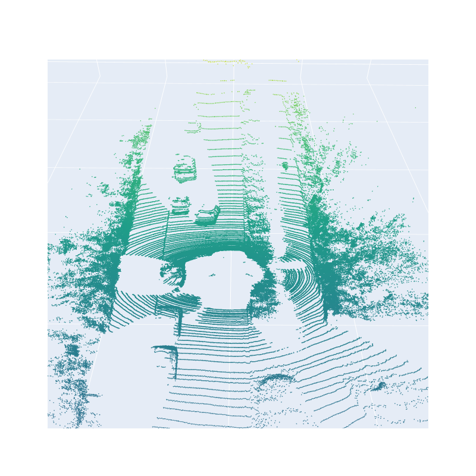

# 3D Point Cloud
*Credits: Mengdi Fan and Daniel Pan*

*Note: Data used here are modified from KITTI dataset.*

### Resources
 - [KITTI](https://www.cvlibs.net/datasets/KITTI/eval_object.php?obj_benchmark=3d)
 - [KITTI coordinate transformations](https://towardsdatascience.com/KITTI-coordinate-transformations-125094cd42fb)
 - [some example codes for KITTI](https://github.com/kuixu/kitti_object_vis)
 - [Plotly](https://plotly.com/python/)

### Homework
 1. update your forked repo from my repo([ref](https://docs.github.com/en/pull-requests/collaborating-with-pull-requests/working-with-forks/syncing-a-fork))
 1. following [01_git](../01_git/), create a new branch `LAST#_10pc` (ex: pan667_10pc) in your forked repo
 1. read and understand what KITTI Point Cloud format is
 1. download `KITTI raw data development kit` [here](https://www.cvlibs.net/datasets/KITTI/raw_data.php) and `KITTI object development kit ` [here](https://www.cvlibs.net/datasets/KITTI/eval_object.php?obj_benchmark=3d), read `readme.txt` in both kits and tutorials to understand 
    - how KITTI organize its dataset
    - coordinate systems of different sensors (each sensor, like camera1, camera2, or lidar, has its origion and coordinate system)
    - how to transform from one coordinate system to another (e.g. lidar to camera) by calibration matrix (e.g. `calib.txt`)
    - annotation file (what each column means, for example in `label.txt`)
 1. activate the environment you created in [03_conda](../03_conda/)
 1. install `Plotly` with `Jupyter-lab` support
 1. create a notebook under `submissions` and name as `LAST#.ipynb`
 1. start `jupyterlab`, it should open a window in your browser. open your `LAST#.ipynb`
 1. write your code to read in point cloud
    - use `fromfile` in `numpy`
    - default data type in `fromfile` is `float64` but KITTI uses `float32`, specify data type when reading
    - point clouds in KITTI consist of 4 channels, x, y, z and r (reflectance); you will see a 1D array (x1, y1, z1, r1, x2, y2, z2, r2, ...) after reading; reshape this array into (N, 4); you can drop the last column r to become (N, 3)
 1. write your code to visualize point cloud in Velodyne coordinate (no projection needed right now); use `graph_objects.Scatter3d` in `Plotly`
    - set aspect ratio of [x, y, z] to [1, 1, 0.15] (important step, without it you can barely recognize the shape of objects due to stretch in z)
 1. write your code to visualize point cloud in Camera coordinate; use `graph_objects.Scatter3d` in `Plotly` (projection needed because in KITTI 3D bounding boxes are annotated in camera coordinate. To correctly plot the boxes, you either project point clouds to camera coordinate or boxes to Velodyne coordinate. Here we try the former.)
    - X2 = R0_rect @ Tr_velo_to_cam @ X1 (This formula is in the readme of KITTI. Please try to understand it. Basically it converts points from Velodyne coordinate to camera coordinate and then rectifies it.)
    - Now turn all matrices and points to homogeneous; append a row (0, 0, 0, 1) to Tr_velo_to_cam (3, 4) to become (4, 4); pad R0_rect (3, 3) with zeros to become (4, 4) and assign element at (4, 4) to 1; append a column of 1 to X1 (N, 3) to become (N, 4)
    - do the multiplication following the formula (you need to transpose X1 to (4, N) and transpose X2 back to (N, 4) because think about the rule of matrix multiplication: (4, 4) @ (4, N) = (4, N))
    - drop the last column in X2 and plot it (similar to previous item but aspect ratio becomes [1, 0.15, 1] because now y axis is pointing to the ground). You should get the result like the following:
    
 1. write your code to visualize 3d bounding boxes in Camera coordinate; use `graph_objects.Scatter3d` in `Plotly`
    - read `label.txt` and parse each line; if the class is "DontCare" skip it; otherwise grab h, w, l, tx, ty, tz, yaw (see the KITTI readme for meanings of each column)
    - get 8 corners of a box with h, w, l which uses center of top face as reference point (this is important because the rotation is operated about the reference point)
    - use [roty](https://github.com/kuixu/kitti_object_vis/blob/master/kitti_util.py#L343) to get the rotation matrix and multiply it with 8 corners
    - translate 8 corners with tx, ty, tz
    - plot the box with 8 corners by `Scatter3d` and use `add_trace` to update the figure (tips: Each point in the list will have an edge connection in scatter with its previous point. Apparently you can not connect all corners at one stroke, so you can think about constructing the list in the way that draws top rectangle first, and then bottom rectangle, and then four edges connecting them. `None` can be the separator in the list to avoid an edge between two points in the list.)
    - you can try to follow the example code [here](https://github.com/kuixu/kitti_object_vis/blob/master/kitti_util.py#L601)
    - you should get the result like the following:
    
 1. stage changes, commit with the message "learning KITTI", push and submit a pr
